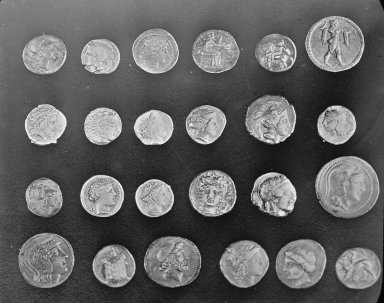

# Filtering Results
**Nama:** Valentino Chryslie Triadi  
**NIM:** 13522164  

---

## Table of Results
| Filter Type | Image Name     | Kernel Size | Sigma | Result                                                                     |
| ----------- | -------------- | ----------- | ----- | -------------------------------------------------------------------------- |
| Original    | Astronaut      | -           | -     |                            |
| Gaussian    | Astronaut      | 5x5         | 1     | .png>)        |
| Gaussian    | Astronaut      | 9x9         | 1     | .png>)        |
| Gaussian    | Astronaut      | 25x25       | 1     | .png>)      |
| Gaussian    | Astronaut      | -           | 2.0   | .png>)         |
| Gaussian    | Astronaut      | -           | 10.0  | .png>)        |
| Median      | Astronaut      | 5x5         | -     | .png>)        |
| Median      | Astronaut      | 9x9         | -     | .png>)        |
| Median      | Astronaut      | 25x25       | -     | .png>)      |
| Original    | Camera         | -           | -     |                               |
| Gaussian    | Camera         | 5x5         | 1     | .png>)           |
| Gaussian    | Camera         | 9x9         | 1     | .png>)           |
| Gaussian    | Camera         | 25x25       | 1     | .png>)         |
| Gaussian    | Camera         | -           | 2.0   | .png>)            |
| Gaussian    | Camera         | -           | 10.0  | .png>)           |
| Median      | Camera         | 5x5         | -     | .png>)           |
| Median      | Camera         | 9x9         | -     | .png>)           |
| Median      | Camera         | 25x25       | -     | .png>)         |
| Original    | Checkerboard   | -           | -     |                         |
| Gaussian    | Checkerboard   | 5x5         | 1     | .png>)     |
| Gaussian    | Checkerboard   | 9x9         | 1     | .png>)     |
| Gaussian    | Checkerboard   | 25x25       | 1     | .png>)   |
| Gaussian    | Checkerboard   | -           | 2.0   | .png>)      |
| Gaussian    | Checkerboard   | -           | 10.0  | .png>)     |
| Median      | Checkerboard   | 5x5         | -     | .png>)     |
| Median      | Checkerboard   | 9x9         | -     | .png>)     |
| Median      | Checkerboard   | 25x25       | -     | .png>)   |
| Original    | Chelsea        | -           | -     |                              |
| Gaussian    | Chelsea        | 5x5         | 1     | .png>)          |
| Gaussian    | Chelsea        | 9x9         | 1     | .png>)          |
| Gaussian    | Chelsea        | 25x25       | 1     | .png>)        |
| Gaussian    | Chelsea        | -           | 2.0   | .png>)           |
| Gaussian    | Chelsea        | -           | 10.0  | .png>)          |
| Median      | Chelsea        | 5x5         | -     | .png>)          |
| Median      | Chelsea        | 9x9         | -     | .png>)          |
| Median      | Chelsea        | 25x25       | -     | .png>)        |
| Original    | Coin           | -           | -     |                                 |
| Gaussian    | Coin           | 5x5         | 1     | .png>)             |
| Gaussian    | Coin           | 9x9         | 1     | .png>)             |
| Gaussian    | Coin           | 25x25       | 1     | .png>)           |
| Gaussian    | Coin           | -           | 2.0   | .png>)              |
| Gaussian    | Coin           | -           | 10.0  | .png>)             |
| Median      | Coin           | 5x5         | -     | .png>)             |
| Median      | Coin           | 9x9         | -     | .png>)             |
| Median      | Coin           | 25x25       | -     | .png>)           |
| Original    | Personal_Image | -           | -     |                       |
| Gaussian    | Personal_Image | 5x5         | 1     | .png>)   |
| Gaussian    | Personal_Image | 9x9         | 1     | .png>)   |
| Gaussian    | Personal_Image | 25x25       | 1     | .png>) |
| Gaussian    | Personal_Image | -           | 2.0   | .png>)    |
| Gaussian    | Personal_Image | -           | 10.0  | .png>)   |
| Median      | Personal_Image | 5x5         | -     | .png>)   |
| Median      | Personal_Image | 9x9         | -     | .png>)   |
| Median      | Personal_Image | 25x25       | -     | .png>) |
