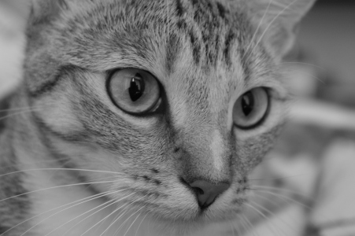
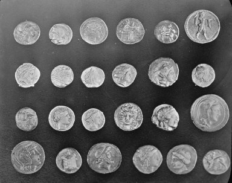
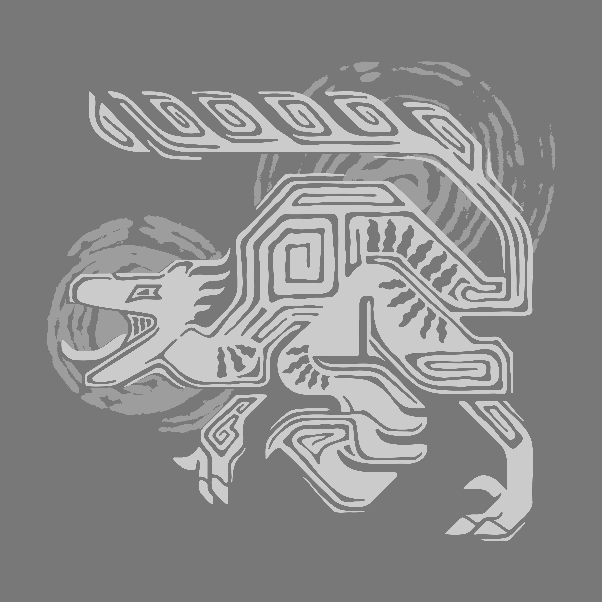

# Edge Detection Results
**Nama:** Valentino Chryslie Triadi  
**NIM:** 13522164  

---

## Table of Results
| Edge Detection Type | Image Name     | Kernel Size / Threshold | Result                                                          |
| ------------------- | -------------- | ----------------------- | --------------------------------------------------------------- |
| Original            | Astronaut      | -                       |                 |
| Sobel               | Astronaut      | 3x3                     | .png>)             |
| Sobel               | Astronaut      | 5x5                     | .png>)             |
| Sobel               | Astronaut      | 7x7                     | .png>)             |
| Sobel               | Astronaut      | 9x9                     | .png>)             |
| Sobel               | Astronaut      | 15x15                   | .png>)           |
| Sobel               | Astronaut      | 25x25                   | .png>)           |
| Canny               | Astronaut      | 30-100                  | .png>)       |
| Canny               | Astronaut      | 50-150                  | .png>)       |
| Canny               | Astronaut      | 100-200                 | .png>)      |
| Canny               | Astronaut      | 150-250                 | .png>)      |
| Original            | Camera         | -                       |                    |
| Sobel               | Camera         | 3x3                     | .png>)                |
| Sobel               | Camera         | 5x5                     | .png>)                |
| Sobel               | Camera         | 7x7                     | .png>)                |
| Sobel               | Camera         | 9x9                     | .png>)                |
| Sobel               | Camera         | 15x15                   | .png>)              |
| Sobel               | Camera         | 25x25                   | .png>)              |
| Canny               | Camera         | 30-100                  | .png>)          |
| Canny               | Camera         | 50-150                  | .png>)          |
| Canny               | Camera         | 100-200                 | .png>)         |
| Canny               | Camera         | 150-250                 | .png>)         |
| Original            | Checkerboard   | -                       |              |
| Sobel               | Checkerboard   | 3x3                     | .png>)          |
| Sobel               | Checkerboard   | 5x5                     | .png>)          |
| Sobel               | Checkerboard   | 7x7                     | .png>)          |
| Sobel               | Checkerboard   | 9x9                     | .png>)          |
| Sobel               | Checkerboard   | 15x15                   | .png>)        |
| Sobel               | Checkerboard   | 25x25                   | .png>)        |
| Canny               | Checkerboard   | 30-100                  | .png>)    |
| Canny               | Checkerboard   | 50-150                  | .png>)    |
| Canny               | Checkerboard   | 100-200                 | .png>)   |
| Canny               | Checkerboard   | 150-250                 | .png>)   |
| Original            | Chelsea        | -                       |                   |
| Sobel               | Chelsea        | 3x3                     | .png>)               |
| Sobel               | Chelsea        | 5x5                     | .png>)               |
| Sobel               | Chelsea        | 7x7                     | .png>)               |
| Sobel               | Chelsea        | 9x9                     | .png>)               |
| Sobel               | Chelsea        | 15x15                   | .png>)             |
| Sobel               | Chelsea        | 25x25                   | .png>)             |
| Canny               | Chelsea        | 30-100                  | .png>)         |
| Canny               | Chelsea        | 50-150                  | .png>)         |
| Canny               | Chelsea        | 100-200                 | .png>)        |
| Canny               | Chelsea        | 150-250                 | .png>)        |
| Original            | Coin           | -                       |                      |
| Sobel               | Coin           | 3x3                     | .png>)                  |
| Sobel               | Coin           | 5x5                     | .png>)                  |
| Sobel               | Coin           | 7x7                     | .png>)                  |
| Sobel               | Coin           | 9x9                     | .png>)                  |
| Sobel               | Coin           | 15x15                   | .png>)                |
| Sobel               | Coin           | 25x25                   | .png>)                |
| Canny               | Coin           | 30-100                  | .png>)            |
| Canny               | Coin           | 50-150                  | .png>)            |
| Canny               | Coin           | 100-200                 | .png>)           |
| Canny               | Coin           | 150-250                 | .png>)           |
| Original            | Personal Image | -                       |            |
| Sobel               | Personal Image | 3x3                     | .png>)        |
| Sobel               | Personal Image | 5x5                     | .png>)        |
| Sobel               | Personal Image | 7x7                     | .png>)        |
| Sobel               | Personal Image | 9x9                     | .png>)        |
| Sobel               | Personal Image | 15x15                   | .png>)      |
| Sobel               | Personal Image | 25x25                   | .png>)      |
| Canny               | Personal Image | 30-100                  | .png>)  |
| Canny               | Personal Image | 50-150                  | .png>)  |
| Canny               | Personal Image | 100-200                 | .png>) |
| Canny               | Personal Image | 150-250                 | .png>) |
