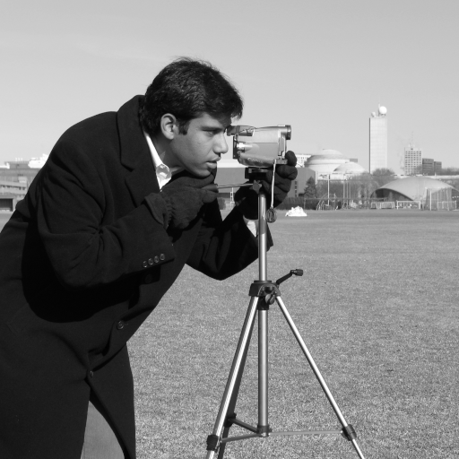
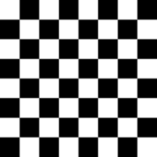
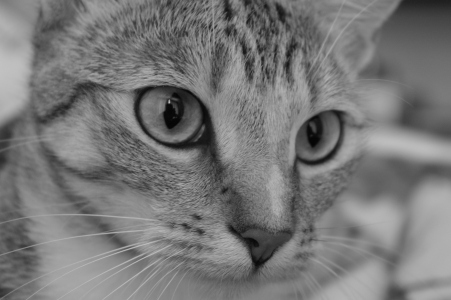
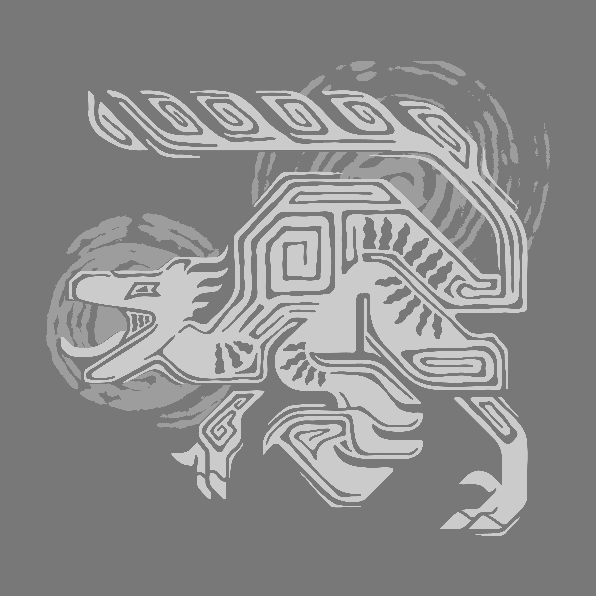

# Feature Point Detection Results

**Nama:** Valentino Chryslie Triadi  
**NIM:** 13522164

---

## Table of Results

| Detector Type | Image Name     | Parameters      | Result                                                          |
| ------------- | -------------- | --------------- | --------------------------------------------------------------- |
| Original      | Astronaut      | -               |                 |
| Harris        | Astronaut      | Block=2, k=0.04 | .png>)      |
| Harris        | Astronaut      | Block=3, k=0.04 | .png>)      |
| Harris        | Astronaut      | Block=5, k=0.06 | .png>)      |
| SIFT          | Astronaut      | N=100           | .png>)                    |
| SIFT          | Astronaut      | N=200           | .png>)                    |
| SIFT          | Astronaut      | All             | .png>)                      |
| FAST          | Astronaut      | Threshold=10    | .png>)             |
| FAST          | Astronaut      | Threshold=25    | .png>)             |
| Original      | Camera         | -               |                    |
| Harris        | Camera         | Block=2, k=0.04 | .png>)         |
| Harris        | Camera         | Block=3, k=0.04 | .png>)         |
| Harris        | Camera         | Block=5, k=0.06 | .png>)         |
| SIFT          | Camera         | N=100           | .png>)                       |
| SIFT          | Camera         | N=200           | .png>)                       |
| SIFT          | Camera         | All             | .png>)                         |
| FAST          | Camera         | Threshold=10    | .png>)                |
| FAST          | Camera         | Threshold=25    | .png>)                |
| Original      | Checkerboard   | -               |              |
| Harris        | Checkerboard   | Block=2, k=0.04 | .png>)   |
| Harris        | Checkerboard   | Block=3, k=0.04 | .png>)   |
| Harris        | Checkerboard   | Block=5, k=0.06 | .png>)   |
| SIFT          | Checkerboard   | N=100           | .png>)                 |
| SIFT          | Checkerboard   | N=200           | .png>)                 |
| SIFT          | Checkerboard   | All             | .png>)                   |
| FAST          | Checkerboard   | Threshold=10    | .png>)          |
| FAST          | Checkerboard   | Threshold=25    | .png>)          |
| Original      | Chelsea        | -               |                   |
| Harris        | Chelsea        | Block=2, k=0.04 | .png>)        |
| Harris        | Chelsea        | Block=3, k=0.04 | .png>)        |
| Harris        | Chelsea        | Block=5, k=0.06 | .png>)        |
| SIFT          | Chelsea        | N=100           | .png>)                      |
| SIFT          | Chelsea        | N=200           | .png>)                      |
| SIFT          | Chelsea        | All             | .png>)                        |
| FAST          | Chelsea        | Threshold=10    | .png>)               |
| FAST          | Chelsea        | Threshold=25    | .png>)               |
| Original      | Coin           | -               |                      |
| Harris        | Coin           | Block=2, k=0.04 | .png>)           |
| Harris        | Coin           | Block=3, k=0.04 | .png>)           |
| Harris        | Coin           | Block=5, k=0.06 | .png>)           |
| SIFT          | Coin           | N=100           | .png>)                         |
| SIFT          | Coin           | N=200           | .png>)                         |
| SIFT          | Coin           | All             | .png>)                           |
| FAST          | Coin           | Threshold=10    | .png>)                  |
| FAST          | Coin           | Threshold=25    | .png>)                  |
| Original      | Personal Image | -               |            |
| Harris        | Personal Image | Block=2, k=0.04 | .png>) |
| Harris        | Personal Image | Block=3, k=0.04 | .png>) |
| Harris        | Personal Image | Block=5, k=0.06 | .png>) |
| SIFT          | Personal Image | N=100           | .png>)               |
| SIFT          | Personal Image | N=200           | .png>)               |
| SIFT          | Personal Image | All             | .png>)                 |
| FAST          | Personal Image | Threshold=10    | .png>)        |
| FAST          | Personal Image | Threshold=25    | .png>)        |

---

## Ringkasan Statistik (Statistical Summary)

### Camera Image

#### Harris Corner Detection

| Parameter         | Block=2, k=0.04 | Block=3, k=0.04 | Block=5, k=0.06 |
| ----------------- | --------------- | --------------- | --------------- |
| Features Detected | 4,199           | 5,655           | 9,070           |
| Max Response      | 123,564,768.0   | 125,533,112.0   | 54,971,016.0    |
| Mean Response     | 7,207,999.5     | 7,589,552.5     | 3,912,507.3     |
| Threshold         | 1,235,647.6     | 1,255,331.1     | 549,710.1       |

#### SIFT Feature Detection

| Parameter         | N=100   | N=200   | All     |
| ----------------- | ------- | ------- | ------- |
| Features Detected | 101     | 200     | 791     |
| Max Response      | 0.102   | 0.102   | 0.102   |
| Mean Response     | 0.065   | 0.055   | 0.032   |
| Min Response      | 0.051   | 0.040   | 0.013   |
| Mean Size         | 9.477   | 7.749   | 4.816   |
| Max Size          | 161.235 | 161.235 | 161.235 |
| Min Size          | 1.803   | 1.803   | 1.798   |

#### FAST Feature Detection

| Parameter         | Threshold=10 | Threshold=25 | Threshold=50 |
| ----------------- | ------------ | ------------ | ------------ |
| Features Detected | 6,155        | 1,916        | 330          |
| Max Response      | 183.0        | 183.0        | 183.0        |
| Mean Response     | 23.354       | 39.848       | 75.509       |
| Min Response      | 10.0         | 25.0         | 50.0         |
| Mean Size         | 7.0          | 7.0          | 7.0          |

---

### Checkerboard Image

#### Harris Corner Detection

| Parameter         | Block=2, k=0.04 | Block=3, k=0.04 | Block=5, k=0.06 |
| ----------------- | --------------- | --------------- | --------------- |
| Features Detected | 12,740          | 16,464          | 25,292          |
| Max Response      | 121,958,768.0   | 127,007,712.0   | 57,000,980.0    |
| Mean Response     | 8,065,669.5     | 8,665,298.5     | 4,431,086.5     |
| Threshold         | 1,219,587.7     | 1,270,077.1     | 570,009.8       |

#### SIFT Feature Detection

| Parameter         | N=100 | N=200 | All   |
| ----------------- | ----- | ----- | ----- |
| Features Detected | 100   | 200   | 1,011 |
| Max Response      | 0.065 | 0.065 | 0.065 |
| Mean Response     | 0.043 | 0.037 | 0.021 |
| Min Response      | 0.035 | 0.028 | 0.009 |
| Mean Size         | 7.459 | 6.326 | 4.257 |
| Max Size          | 66.55 | 66.55 | 66.55 |
| Min Size          | 1.800 | 1.800 | 1.800 |

#### FAST Feature Detection

| Parameter         | Threshold=10 | Threshold=25 | Threshold=50 |
| ----------------- | ------------ | ------------ | ------------ |
| Features Detected | 8,888        | 2,648        | 332          |
| Max Response      | 219.0        | 219.0        | 219.0        |
| Mean Response     | 23.866       | 41.842       | 83.398       |
| Min Response      | 10.0         | 25.0         | 50.0         |
| Mean Size         | 7.0          | 7.0          | 7.0          |

---

### Astronaut Image

#### Harris Corner Detection

| Parameter         | Block=2, k=0.04 | Block=3, k=0.04 | Block=5, k=0.06 |
| ----------------- | --------------- | --------------- | --------------- |
| Features Detected | 23,089          | 28,857          | 40,993          |
| Max Response      | 82,621,096.0    | 84,637,472.0    | 38,330,968.0    |
| Mean Response     | 5,437,033.5     | 5,830,313.5     | 3,054,267.5     |
| Threshold         | 826,210.9       | 846,374.7       | 383,309.7       |

#### SIFT Feature Detection

| Parameter         | N=100 | N=200 | All   |
| ----------------- | ----- | ----- | ----- |
| Features Detected | 100   | 200   | 1,433 |
| Max Response      | 0.044 | 0.044 | 0.044 |
| Mean Response     | 0.028 | 0.024 | 0.014 |
| Min Response      | 0.022 | 0.018 | 0.006 |
| Mean Size         | 5.664 | 4.843 | 3.453 |
| Max Size          | 58.48 | 58.48 | 58.48 |
| Min Size          | 1.800 | 1.800 | 1.800 |

#### FAST Feature Detection

| Parameter         | Threshold=10 | Threshold=25 | Threshold=50 |
| ----------------- | ------------ | ------------ | ------------ |
| Features Detected | 13,754       | 3,956        | 471          |
| Max Response      | 186.0        | 186.0        | 186.0        |
| Mean Response     | 22.779       | 39.654       | 77.898       |
| Min Response      | 10.0         | 25.0         | 50.0         |
| Mean Size         | 7.0          | 7.0          | 7.0          |

---

### Chelsea Image

#### Harris Corner Detection

| Parameter         | Block=2, k=0.04 | Block=3, k=0.04 | Block=5, k=0.06 |
| ----------------- | --------------- | --------------- | --------------- |
| Features Detected | 17,632          | 22,236          | 32,544          |
| Max Response      | 79,172,144.0    | 81,039,920.0    | 36,723,568.0    |
| Mean Response     | 5,210,851.0     | 5,580,743.0     | 2,914,952.5     |
| Threshold         | 791,721.4       | 810,399.2       | 367,235.7       |

#### SIFT Feature Detection

| Parameter         | N=100 | N=200 | All   |
| ----------------- | ----- | ----- | ----- |
| Features Detected | 100   | 200   | 1,275 |
| Max Response      | 0.042 | 0.042 | 0.042 |
| Mean Response     | 0.027 | 0.023 | 0.014 |
| Min Response      | 0.022 | 0.017 | 0.006 |
| Mean Size         | 5.521 | 4.721 | 3.409 |
| Max Size          | 55.03 | 55.03 | 55.03 |
| Min Size          | 1.800 | 1.800 | 1.800 |

#### FAST Feature Detection

| Parameter         | Threshold=10 | Threshold=25 | Threshold=50 |
| ----------------- | ------------ | ------------ | ------------ |
| Features Detected | 11,828       | 3,363        | 399          |
| Max Response      | 173.0        | 173.0        | 173.0        |
| Mean Response     | 22.551       | 39.330       | 77.193       |
| Min Response      | 10.0         | 25.0         | 50.0         |
| Mean Size         | 7.0          | 7.0          | 7.0          |

---

### Coin Image

#### Harris Corner Detection

| Parameter         | Block=2, k=0.04 | Block=3, k=0.04 | Block=5, k=0.06 |
| ----------------- | --------------- | --------------- | --------------- |
| Features Detected | 6,901           | 9,197           | 14,799          |
| Max Response      | 123,564,768.0   | 125,533,112.0   | 54,971,016.0    |
| Mean Response     | 7,927,969.5     | 8,403,334.5     | 4,327,677.3     |
| Threshold         | 1,235,647.6     | 1,255,331.1     | 549,710.1       |

#### SIFT Feature Detection

| Parameter         | N=100 | N=200 | All   |
| ----------------- | ----- | ----- | ----- |
| Features Detected | 100   | 200   | 949   |
| Max Response      | 0.079 | 0.079 | 0.079 |
| Mean Response     | 0.052 | 0.044 | 0.025 |
| Min Response      | 0.040 | 0.032 | 0.011 |
| Mean Size         | 7.738 | 6.587 | 4.385 |
| Max Size          | 94.73 | 94.73 | 94.73 |
| Min Size          | 1.800 | 1.800 | 1.800 |

#### FAST Feature Detection

| Parameter         | Threshold=10 | Threshold=25 | Threshold=50 |
| ----------------- | ------------ | ------------ | ------------ |
| Features Detected | 7,563        | 2,284        | 311          |
| Max Response      | 183.0        | 183.0        | 183.0        |
| Mean Response     | 23.473       | 40.164       | 77.244       |
| Min Response      | 10.0         | 25.0         | 50.0         |
| Mean Size         | 7.0          | 7.0          | 7.0          |

---

### Comparison Summary

| Detector | Speed     | Scale Invariant | Rotation Invariant | Features Count (avg) |
| -------- | --------- | --------------- | ------------------ | -------------------- |
| Harris   | Medium    | No              | No                 | 4,199-40,993         |
| SIFT     | Slow      | Yes             | Yes                | 100-1,433            |
| FAST     | Very Fast | No              | No                 | 330-13,754           |

---
